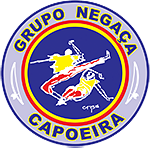

Grupo Negaça (ne-ga-sa) Capoeira, founded on 3rd March 2005 by Mestre Chitãozinho and his students, is dedicated to stimulating the practical, cultural and intellectual development of capoeira.
Grupo Negaça Capoeira functions in 10 cities in the northeast of Brazil. In July 2008 Mestre Chitãozinho brought Grupo Negaça Capoeira to England.

## Our Philosophy

The philosophy of Grupo Negaça Capoeira is rooted in the philosophies of the great capoeira masters - Grande-mestres - of the past, and some of the present day. Master Chitãozinho has drawn on those philosophies that looked to preserve the cultural, historical, and spiritual traditions of capoeira. These philosophies serve to guide and help capoeiristas within the roda-de-capoeira and also in their everyday lives.
The philosophy of Grupo Negaça Capoeira embraces the following principles. They are not strict guidelines, but rather some suggestions that form the underlying ideologies of Grupo Negaça Capoeira's philosophy:
 
* Respect for all other capoeiristas, whether from within the same group or from other groups.
* Willingness to represent the capoeirista community in a positive way.
* Respect for capoeira masters - mestres - that are worthy of such respect.
* Willingness to help preserve and promote capoeira with its traditions and values.
* Aspiration to put the philosophy of the group into practice; to make less errors; to strive to get things right so that the group's philosophy can be carried forward with a correct attitude towards capoeira and life rather than with words.
* Willingness to work hard today to understand the technical and theoretical bases of capoeira, thus spreading the philosophy of the group and enabling a better tomorrow.
* Aspiration to integrate Capoeira into society.
* Willingness to reflect upon one's own moral development within capoeira and encourage the same in others, in order to stimulate a sense of peace rather than violence within the capoeira community.
* Recognition that it is more important to try to change yourself in a positive way than attempt to change the whole world, as self-improvement can often encourage others to do the same.

## Grading System

Like many capoeira groups, Negaça Capoeira has a grading system that is represented by wearing coloured belts around the waist and which hang to the left at knee level. The grades for 13 year olds + work as follows:

### Adult grades

Batizado Student - 1 year  

Intermediate Student - 2 years  

Advanced Student - 3 years  

Graduate Student - 4 years minimum  

Monitor - 5 years min.  

Instrutor - 7 years min.  

Professor - 10 years min.  

Contramestre - 15 years min.  

Mestre - 1st, 2nd and 3rd grade - 20, 25 and 30 years  
  
  
  

### Infant Grades

Children under the age of 13 have the following grade system:  
  
  
  
  
  
  
  

